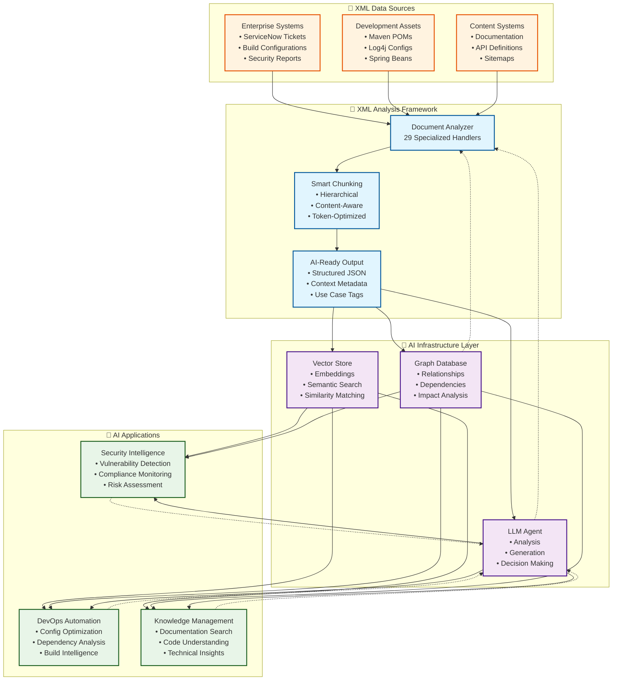
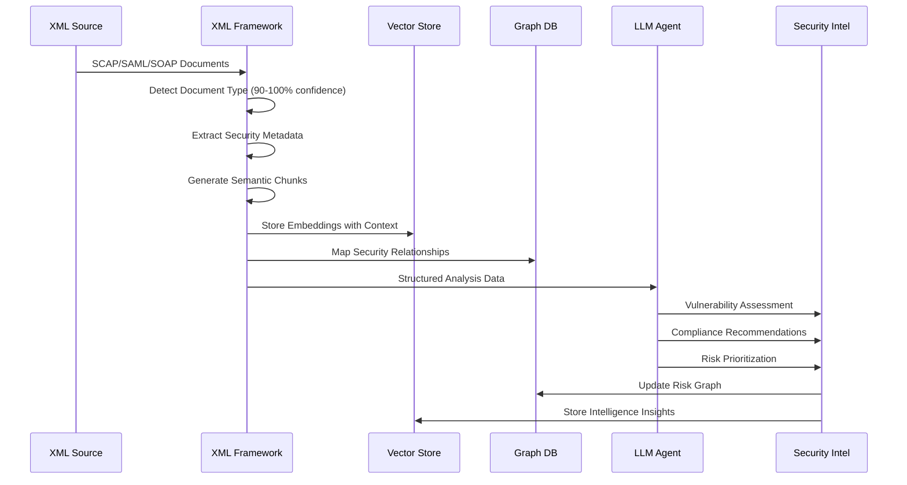
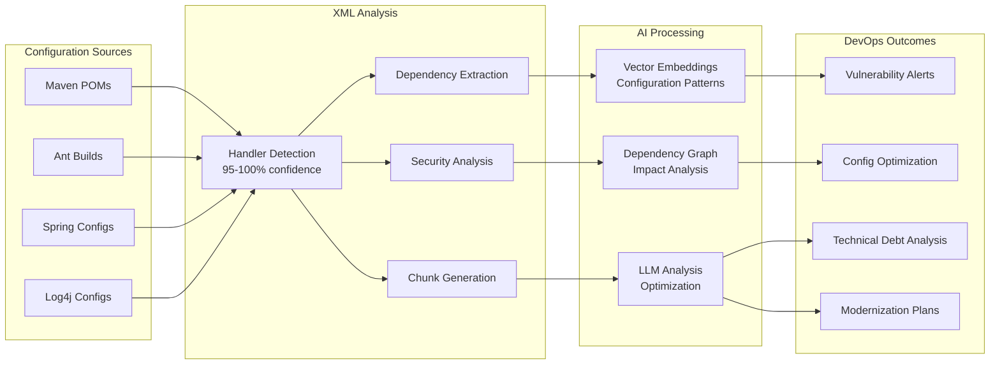
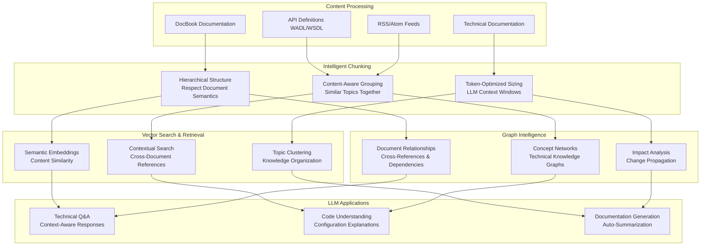

# XML Analysis Framework - AI Integration Architecture

## 🚀 AI Workflow Integration Diagram



## 🔄 Detailed Integration Workflows

### 1. **Security Intelligence Pipeline**



### 2. **DevOps Configuration Intelligence**



### 3. **Knowledge Management Pipeline**



## 🛠️ Technical Implementation Examples

### Vector Store Integration
```python
from xml_analysis_framework import XMLDocumentAnalyzer, ChunkingOrchestrator
import chromadb

# Initialize framework
analyzer = XMLDocumentAnalyzer()
chunker = ChunkingOrchestrator()

# Process XML documents
analysis = analyzer.analyze_document("config.xml")
chunks = chunker.chunk_document("config.xml", analysis)

# Store in vector database
client = chromadb.Client()
collection = client.create_collection("xml_knowledge")

for chunk in chunks:
    collection.add(
        documents=[chunk.content],
        metadatas=[{
            "document_type": analysis["document_type"].type_name,
            "handler": analysis["handler_used"],
            "confidence": analysis["confidence"],
            "chunk_path": chunk.element_path,
            "ai_use_cases": str(analysis["analysis"].ai_use_cases)
        }],
        ids=[chunk.chunk_id]
    )
```

### Graph Database Integration
```python
from neo4j import GraphDatabase

class XMLGraphBuilder:
    def __init__(self, uri, user, password):
        self.driver = GraphDatabase.driver(uri, auth=(user, password))
    
    def build_config_graph(self, analysis_results):
        with self.driver.session() as session:
            # Create document node
            session.run("""
                MERGE (doc:XMLDocument {
                    path: $path,
                    type: $doc_type,
                    handler: $handler,
                    confidence: $confidence
                })
            """, 
                path=analysis_results["file_path"],
                doc_type=analysis_results["document_type"].type_name,
                handler=analysis_results["handler_used"],
                confidence=analysis_results["confidence"]
            )
            
            # Create dependency relationships for build files
            if "dependencies" in analysis_results["analysis"].key_findings:
                for dep in analysis_results["analysis"].key_findings["dependencies"]:
                    session.run("""
                        MATCH (doc:XMLDocument {path: $path})
                        MERGE (dep:Dependency {name: $dep_name})
                        MERGE (doc)-[:DEPENDS_ON]->(dep)
                    """, 
                        path=analysis_results["file_path"],
                        dep_name=dep["name"]
                    )
```

### LLM Agent Integration
```python
from openai import OpenAI

class XMLIntelligenceAgent:
    def __init__(self, openai_client):
        self.client = openai_client
        self.analyzer = XMLDocumentAnalyzer()
    
    def analyze_security_posture(self, xml_files):
        security_insights = []
        
        for xml_file in xml_files:
            analysis = self.analyzer.analyze_document(xml_file)
            
            if "security" in analysis["document_type"].type_name.lower():
                prompt = f"""
                Analyze this {analysis['document_type'].type_name} document:
                
                Key Findings: {analysis['analysis'].key_findings}
                Security Metrics: {analysis['analysis'].quality_metrics}
                
                Provide security recommendations and risk assessment.
                """
                
                response = self.client.chat.completions.create(
                    model="gpt-4",
                    messages=[{
                        "role": "system", 
                        "content": "You are a cybersecurity expert analyzing XML configurations."
                    }, {
                        "role": "user", 
                        "content": prompt
                    }]
                )
                
                security_insights.append({
                    "file": xml_file,
                    "document_type": analysis["document_type"].type_name,
                    "analysis": response.choices[0].message.content,
                    "confidence": analysis["confidence"]
                })
        
        return security_insights
```

## 🎯 AI Use Case Categories

### **Enterprise Security Intelligence**
- **SCAP Compliance Monitoring**: Automated security posture assessment
- **SAML Security Analysis**: Authentication flow vulnerability detection  
- **Log4j Vulnerability Scanning**: CVE detection and remediation guidance
- **SOAP Security Assessment**: Web service security configuration review

### **DevOps & Configuration Intelligence**
- **Dependency Risk Analysis**: Maven/Ant/Ivy dependency vulnerability scanning
- **Configuration Drift Detection**: Hibernate/Spring configuration consistency
- **Build Optimization**: Performance and security improvements for build systems
- **Technical Debt Assessment**: Legacy configuration modernization planning

### **Knowledge Management & Documentation**
- **Technical Documentation Search**: Semantic search across DocBook, XHTML content
- **API Discovery**: WADL/WSDL service catalog and integration guidance
- **Content Intelligence**: RSS/Atom feed analysis for trend detection
- **Cross-Reference Analysis**: Document relationship mapping and impact analysis

### **Geospatial & Data Intelligence**
- **Route Optimization**: GPX track analysis for logistics and fitness
- **Geographic Pattern Analysis**: KML data for location intelligence
- **Network Analysis**: GraphML data for system topology understanding
- **Translation Workflow**: XLIFF analysis for localization intelligence

## 📊 Performance Characteristics

### **Framework Performance**
- **Processing Speed**: 38.8 chunks/file average, 0.015s per document
- **Accuracy**: 95-100% confidence for specialized handlers
- **Scalability**: Handles 71 diverse XML files with 100% success rate
- **Memory Efficiency**: Streaming processing for large documents

### **AI Integration Benefits**
- **Context Preservation**: Semantic chunking maintains document structure
- **Relationship Mapping**: Graph integration enables dependency analysis  
- **Semantic Search**: Vector embeddings enable intelligent content discovery
- **Automated Insights**: LLM integration provides expert-level analysis

## 🔮 Future AI Applications

### **Predictive Analytics**
- **Security Breach Prediction**: Historical SCAP data pattern analysis
- **Configuration Failure Prediction**: Build system reliability modeling
- **Performance Optimization**: Predictive configuration tuning

### **Automated Remediation**
- **Security Fix Generation**: Automated SAML/SOAP security improvements
- **Configuration Modernization**: Legacy Spring/Hibernate migration assistance
- **Dependency Upgrade Planning**: Automated dependency update strategies

### **Intelligence Fusion**
- **Cross-System Correlation**: ServiceNow incidents + system configurations
- **Impact Analysis**: Change propagation across enterprise systems
- **Risk Scoring**: Comprehensive security posture assessment