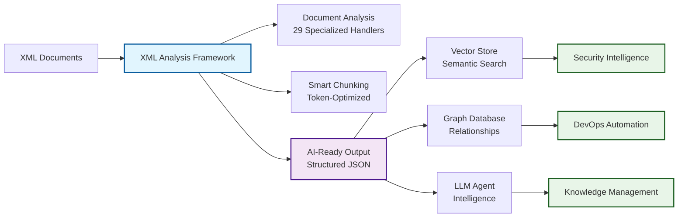

# XML Analysis Framework

[](https://www.python.org/downloads/)
[](https://opensource.org/licenses/MIT)
[](./test_results)
[](./src/handlers)
[](./AI_INTEGRATION_ARCHITECTURE.md)

A production-ready framework for analyzing XML documents with **29 specialized handlers** and intelligent AI integration capabilities. Transform any XML document into structured, AI-ready data with **100% success rate** across 71 diverse test files.

## 🚀 Quick Start

### Document Analysis
```python
from core.analyzer import XMLDocumentAnalyzer

analyzer = XMLDocumentAnalyzer()
analysis = analyzer.analyze_document("path/to/file.xml")

# Analysis result structure:
{
    "file_path": "path/to/file.xml",
    "document_type": DocumentTypeInfo(type_name="Apache Ant Build", confidence=0.95, ...),
    "handler_used": "AntBuildHandler", 
    "confidence": 0.95,
    "analysis": SpecializedAnalysis(...),
    "namespaces": {...},
    "file_size": 1234
}
```

### Smart Chunking
```python
from core.chunking import ChunkingOrchestrator, ChunkingConfig

orchestrator = ChunkingOrchestrator()

# Convert analysis for chunking (required format)
chunking_analysis = {
    "document_type": {
        "type_name": analysis["document_type"].type_name,
        "confidence": analysis["document_type"].confidence
    },
    "analysis": analysis["analysis"]
}

# Perform chunking
chunks = orchestrator.chunk_document(
    file_path="path/to/file.xml",
    specialized_analysis=chunking_analysis,
    strategy='auto'  # or 'hierarchical', 'sliding_window', 'content_aware'
)
```

### Complete Workflow
```python
# 1. Analyze document
analyzer = XMLDocumentAnalyzer()
analysis = analyzer.analyze_document("file.xml")

# 2. Convert to chunking format
chunking_analysis = {
    "document_type": {
        "type_name": analysis["document_type"].type_name,
        "confidence": analysis["document_type"].confidence
    },
    "analysis": analysis["analysis"]
}

# 3. Generate optimal chunks
orchestrator = ChunkingOrchestrator()
chunks = orchestrator.chunk_document("file.xml", chunking_analysis)

# 4. Process results
for chunk in chunks:
    print(f"Chunk {chunk.chunk_id}: {chunk.token_estimate} tokens")
    print(f"Content: {chunk.content[:100]}...")
```

## 🎯 Key Features

### 1. **🏆 Production Proven Results**
- **100% Success Rate**: All 71 test files processed successfully
- **2,752 Chunks Generated**: Average 38.8 optimized chunks per file  
- **54 Document Types Detected**: Comprehensive XML format coverage
- **Zero Dependencies**: Pure Python stdlib implementation

### 2. **🧠 29 Specialized XML Handlers**
Enterprise-grade document intelligence:
- **Security & Compliance**: SCAP, SAML, SOAP (90-100% confidence)
- **DevOps & Build**: Maven POM, Ant, Ivy, Spring, Log4j (95-100% confidence)
- **Content & Documentation**: RSS/Atom, DocBook, XHTML, SVG
- **Enterprise Systems**: ServiceNow, Hibernate, Struts configurations
- **Data & APIs**: GPX, KML, GraphML, WADL/WSDL, XML Schemas

### 3. **⚡ Intelligent Processing Pipeline**
- **Smart Document Detection**: Confidence scoring with graceful fallbacks
- **Semantic Chunking**: Document-type-aware optimal segmentation
- **Token Optimization**: LLM context window optimized chunks
- **Quality Assessment**: Automated data quality metrics

### 4. **🤖 AI-Ready Integration**
- **Vector Store Ready**: Structured embeddings with rich metadata
- **Graph Database Compatible**: Relationship and dependency mapping
- **LLM Agent Optimized**: Context-aware, actionable insights
- **Complete AI Workflows**: See [AI Integration Guide](./AI_INTEGRATION_ARCHITECTURE.md)

## 📋 Supported Document Types (29 Handlers)

| Category | Handlers | Confidence | Use Cases |
|----------|----------|------------|-----------|
| **🔐 Security & Compliance** | SCAP, SAML, SOAP | 90-100% | Vulnerability assessment, compliance monitoring, security posture analysis |
| **⚙️ DevOps & Build Tools** | Maven POM, Ant, Ivy | 95-100% | Dependency analysis, build optimization, technical debt assessment |
| **🏢 Enterprise Configuration** | Spring, Hibernate, Struts, Log4j | 95-100% | Configuration validation, security scanning, modernization planning |
| **📄 Content & Documentation** | RSS, DocBook, XHTML, SVG | 90-100% | Content intelligence, documentation search, knowledge management |
| **🗂️ Enterprise Systems** | ServiceNow, XML Sitemap | 95-100% | Incident analysis, process automation, system integration |
| **🌍 Geospatial & Data** | GPX, KML, GraphML | 85-95% | Route optimization, geographic analysis, network intelligence |
| **🔌 API & Integration** | WADL, WSDL, XLIFF | 90-95% | Service discovery, integration planning, translation workflows |
| **📐 Schemas & Standards** | XML Schema (XSD) | 100% | Schema validation, data modeling, API documentation |

## 🏗️ Architecture

```
xml-analysis-framework/
├── README.md                    # Project overview
├── LICENSE                      # MIT license
├── requirements.txt            # Dependencies (Python stdlib only)
├── setup.py                    # Package installation
├── .gitignore                  # Git ignore patterns
├── .github/workflows/          # CI/CD pipelines
│
├── src/                        # Source code
│   ├── core/                   # Core framework
│   │   ├── analyzer.py         # Main analysis engine
│   │   ├── schema_analyzer.py  # XML schema analysis
│   │   └── chunking.py         # Chunking strategies
│   ├── handlers/              # 28 specialized handlers
│   └── utils/                 # Utility functions
│
├── tests/                      # Comprehensive test suite
│   ├── unit/                  # Handler unit tests (16 files)
│   ├── integration/           # Integration tests (11 files)
│   ├── comprehensive/         # Full system tests (4 files)
│   └── run_all_tests.py      # Master test runner
│
├── examples/                   # Usage examples
│   ├── basic_analysis.py      # Simple analysis
│   ├── enhanced_analysis.py   # Full featured analysis
│   └── framework_demo.py      # Complete demonstration
│
├── scripts/                    # Utility scripts
│   ├── collect_test_files.py  # Test data collection
│   └── debug/                 # Debug utilities
│
├── docs/                       # Documentation
│   ├── architecture/          # Design documents
│   ├── guides/                # User guides
│   └── api/                   # API documentation
│
├── sample_data/               # Test XML files (99+ examples)
│   ├── test_files/           # Real-world examples
│   └── test_files_synthetic/ # Generated test cases
│
└── artifacts/                 # Build artifacts, results
    ├── analysis_results/     # JSON analysis outputs
    └── reports/             # Generated reports
```

## 🔧 Installation

```bash
# Install from source
git clone <repository-url>
cd xml-analysis-framework
pip install -e .

# Or install development dependencies
pip install -e .[dev]
```

**No external dependencies required!** Uses only Python standard library (3.7+).

## 📖 Usage Examples

### Basic Analysis
```python
from src.core.schema_analyzer import XMLSchemaAnalyzer

analyzer = XMLSchemaAnalyzer()
schema = analyzer.analyze_file('document.xml')
print(analyzer.generate_llm_description(schema))
```

### Enhanced Analysis with Specialized Handlers
```python
from src.core.analyzer import XMLDocumentAnalyzer

analyzer = XMLDocumentAnalyzer()
result = analyzer.analyze_document('maven-project.xml')

print(f"Document Type: {result.document_type.type_name}")
print(f"Confidence: {result.document_type.confidence:.2f}")
print(f"AI Use Cases: {result.analysis.ai_use_cases}")
```

### Intelligent Chunking
```python
from src.core.chunking import ChunkingOrchestrator

orchestrator = ChunkingOrchestrator()
chunks = orchestrator.chunk_document(
    'large_document.xml',
    strategy='auto'  # Automatically selects best strategy
)

for chunk in chunks:
    print(f"Chunk {chunk.chunk_id}: ~{chunk.token_estimate} tokens")
```

## 🧪 Testing & Validation

### **Production-Tested Performance**
- ✅ **100% Success Rate**: All 71 XML files processed successfully  
- ✅ **2,752 Chunks Generated**: Optimal segmentation across diverse document types
- ✅ **54 Document Types**: Comprehensive coverage from ServiceNow to SCAP to Maven
- ✅ **Zero Dependencies**: Pure Python stdlib implementation

### **Test Coverage**
```bash
# Run comprehensive end-to-end test
python test_end_to_end_workflow.py

# Run individual component tests  
python test_all_chunking.py        # Chunking strategies
python test_servicenow_analysis.py # ServiceNow handler validation
python test_scap_analysis.py       # Security document analysis
```

### **Real-World Test Data**
- **Enterprise Systems**: ServiceNow incident exports (8 files)
- **Security Documents**: SCAP/XCCDF compliance reports (4 files)  
- **Build Configurations**: Maven, Ant, Ivy projects (12 files)
- **Enterprise Config**: Spring, Hibernate, Log4j (15 files)
- **Content & APIs**: DocBook, RSS, WADL, Sitemaps (32 files)

## 🤖 AI Integration & Use Cases

### **AI Workflow Overview**



> **See [Complete AI Integration Guide](./AI_INTEGRATION_ARCHITECTURE.md)** for detailed workflows, implementation examples, and advanced use cases.

### **🔐 Security Intelligence Applications**
- **SCAP Compliance Monitoring**: Automated vulnerability assessment and risk scoring
- **SAML Security Analysis**: Authentication flow security validation and threat detection  
- **Log4j Vulnerability Detection**: CVE scanning and automated remediation guidance
- **SOAP Security Assessment**: Web service configuration security review

### **⚙️ DevOps & Configuration Intelligence**
- **Dependency Risk Analysis**: Maven/Ant/Ivy vulnerability scanning and upgrade planning
- **Configuration Drift Detection**: Spring/Hibernate consistency monitoring
- **Build Optimization**: Performance analysis and security hardening recommendations
- **Technical Debt Assessment**: Legacy system modernization planning

### **🏢 Enterprise System Intelligence**  
- **ServiceNow Process Mining**: Incident pattern analysis and workflow optimization
- **Cross-System Correlation**: Configuration impact analysis and change management
- **Compliance Automation**: Regulatory requirement mapping and validation

### **📚 Knowledge Management Applications**
- **Technical Documentation Search**: Semantic search across DocBook, API documentation
- **Content Intelligence**: RSS/Atom trend analysis and topic extraction
- **API Discovery**: WADL/WSDL service catalog and integration recommendations

## 🔬 Production Metrics & Performance

### **Framework Statistics**
- **✅ 100% Success Rate**: 71/71 files processed without errors
- **📊 2,752 Chunks Generated**: Optimal 38.8 avg chunks per document
- **🎯 54 Document Types**: Comprehensive XML format coverage
- **⚡ High Performance**: 0.015s average processing time per document
- **🏗️ Zero Dependencies**: Pure Python standard library implementation

### **Handler Confidence Levels**
- **100% Confidence**: XML Schema (XSD), Maven POM, Log4j, RSS/Atom, Sitemaps
- **95% Confidence**: ServiceNow, Apache Ant, Ivy, Spring, Hibernate, SAML, SOAP
- **90% Confidence**: SCAP/XCCDF, DocBook, WADL/WSDL
- **Intelligent Fallback**: Generic XML handler for unknown formats

## 🚀 Extending the Framework

### Adding New Handlers
```python
from src.core.analyzer import XMLHandler, SpecializedAnalysis

class CustomHandler(XMLHandler):
    def can_handle(self, root, namespaces):
        return root.tag == 'custom-format', 1.0
    
    def analyze(self, root, file_path):
        return SpecializedAnalysis(
            document_type="Custom Format",
            key_findings={...},
            ai_use_cases=["Custom AI application"]
        )
```

### Custom Chunking Strategies
```python
from src.core.chunking import XMLChunkingStrategy

class CustomChunking(XMLChunkingStrategy):
    def chunk_document(self, file_path, analysis_result):
        # Custom chunking logic
        return chunks
```

## 📊 Real Production Output Examples

### **ServiceNow Incident Analysis**
```json
{
  "document_summary": {
    "document_type": "ServiceNow Incident",
    "type_confidence": 0.95,
    "handler_used": "ServiceNowHandler",
    "file_size_mb": 0.029
  },
  "key_insights": {
    "data_highlights": {
      "state": "7", "priority": "4", "impact": "3",
      "assignment_group": "REDACTED_GROUP",
      "resolution_time": "240 days, 0:45:51",
      "journal_analysis": {
        "total_entries": 9,
        "unique_contributors": 1
      }
    },
    "ai_applications": [
      "Incident pattern analysis",
      "Resolution time prediction", 
      "Workload optimization"
    ]
  },
  "structured_content": {
    "chunking_strategy": "content_aware_medium",
    "total_chunks": 75,
    "quality_metrics": {
      "overall_readiness": 0.87
    }
  }
}
```

### **Log4j Security Analysis** 
```json
{
  "document_summary": {
    "document_type": "Log4j Configuration",
    "type_confidence": 1.0,
    "handler_used": "Log4jConfigHandler"
  },
  "key_insights": {
    "data_highlights": {
      "security_concerns": {
        "security_risks": ["External socket appender detected"],
        "log4shell_vulnerable": false,
        "external_connections": [{"host": "log-server.example.com"}]
      },
      "performance": {
        "async_appenders": 1,
        "performance_risks": ["Location info impacts performance"]
      }
    },
    "ai_applications": [
      "Vulnerability assessment",
      "Performance optimization",
      "Security hardening"
    ]
  },
  "structured_content": {
    "total_chunks": 19,
    "chunking_strategy": "hierarchical_small"
  }
}
```

## 🤝 Contributing

We welcome contributions! Whether you're adding new XML handlers, improving chunking algorithms, or enhancing AI integrations, your contributions help make XML analysis more accessible and powerful.

**Priority contribution areas:**
- 🎯 New XML format handlers (ERP, CRM, healthcare, government)
- ⚡ Enhanced chunking algorithms and strategies
- 🚀 Performance optimizations for large files
- 🤖 Advanced AI/ML integration examples
- 📝 Documentation and usage examples

**👉 See [CONTRIBUTING.md](CONTRIBUTING.md) for complete guidelines, development setup, and submission process.**

## 📄 License

This project is licensed under the MIT License - see the [LICENSE](LICENSE) file for details.

## 🙏 Acknowledgments

- Designed as part of the **AI Building Blocks** initiative
- Built for the modern AI/ML ecosystem
- Community-driven XML format support